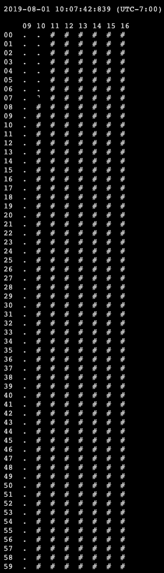

# 1440-clock

> Minimalist clocks that visualize the 1,440 precious minutes each of us has
> in a day

## About

I wanted a simple visualization of the 1,440 precious minutes each of us has in
a day. By default, these clocks show you a visual countdown of the minutes you
have remaining before midnight.

## Usage

There are two clocks available:

- https://robatron.github.io/1440-clock/
- https://robatron.github.io/1440-clock/bars

To configure these clocks you can use the following query parameters:

-   `dh` - Number of hours to display
-   `hw` - Hide words in the UI, display only the clock
-   `sh` - Starting hour
-   `sm` - Starting minute

For example, this configuration shows an 8-hour workday, from 07:15 to 15:15:

https://robatron.github.io/1440-clock/?dh=8&sh=7&sm=15

## Screenshots

Default:

Customized to show an 8-hour, 9-5 workday:

# License (MIT)

Copyright 2019 Robert McGuire

Permission is hereby granted, free of charge, to any person obtaining a copy of
this software and associated documentation files (the "Software"), to deal in
the Software without restriction, including without limitation the rights to
use, copy, modify, merge, publish, distribute, sublicense, and/or sell copies of
the Software, and to permit persons to whom the Software is furnished to do so,
subject to the following conditions:

The above copyright notice and this permission notice shall be included in all
copies or substantial portions of the Software.

THE SOFTWARE IS PROVIDED "AS IS", WITHOUT WARRANTY OF ANY KIND, EXPRESS OR
IMPLIED, INCLUDING BUT NOT LIMITED TO THE WARRANTIES OF MERCHANTABILITY, FITNESS
FOR A PARTICULAR PURPOSE AND NONINFRINGEMENT. IN NO EVENT SHALL THE AUTHORS OR
COPYRIGHT HOLDERS BE LIABLE FOR ANY CLAIM, DAMAGES OR OTHER LIABILITY, WHETHER
IN AN ACTION OF CONTRACT, TORT OR OTHERWISE, ARISING FROM, OUT OF OR IN
CONNECTION WITH THE SOFTWARE OR THE USE OR OTHER DEALINGS IN THE SOFTWARE.
