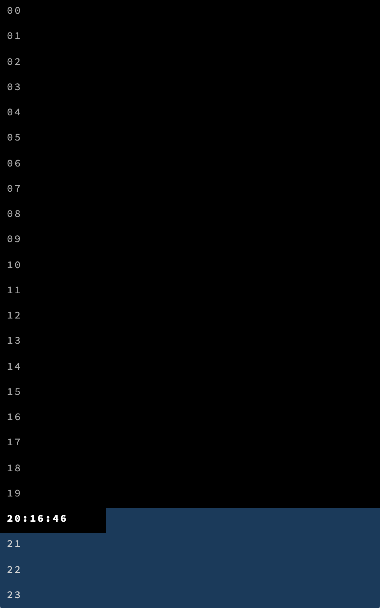

# 1440-clock

> Minimalist clocks that visualize the 1,440 precious minutes each of us has
> in a day

## About

I wanted a simple visualization of the 1,440 precious minutes each of us has in
a day. By default, these clocks show you a visual countdown of the minutes you
have remaining before midnight.

## Usage

There are two clocks available:

-   **Default:** https://robatron.github.io/1440-clock/
-   **Bars:** https://robatron.github.io/1440-clock/bars

To configure these clocks you can use the following query parameters:

-   `dh` - Number of hours to display
-   `hw` - Hide words in the UI, display only the clock
-   `sh` - Starting hour
-   `sm` - Starting minute

For example, this configuration shows an 8-hour workday, from 07:15 to 15:15:

-   https://robatron.github.io/1440-clock/?dh=8&sh=7&sm=15

## Screenshots

Default clock example:

"Bars" clock example:

